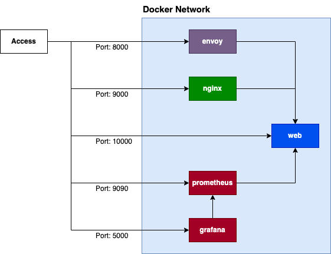

# Envoy Local Ratelimit vs Nginx Ratelimit

## Usage

```bash
$ docker -v
Docker version 20.10.11, build dea9396
```

**Step 1**

```bash
$ docker compose build
```

**Step 2**

```bash
$ docker compose up
```

**Step 3**

```bash
# Via Envoy
$ echo "GET http://localhost:8000/envoy" | vegeta attack -rate=20/s -duration=300s -timeout=10s | tee results.bin | vegeta report

# Via nginx
$ echo "GET http://localhost:9000/nginx" | vegeta attack -rate=20/s -duration=300s -timeout=10s | tee results.bin | vegeta report
```

**Step 4**

try load test

## Load Test

## Architecture

| Application |  Port | Description                                        |
| :---------- | ----: | :------------------------------------------------- |
| envoy       |  8000 | Proxy to web.                                      |
| nginx       |  9000 | Proxy to web.                                      |
| web         | 10000 | A simple NodeJS web server.                        |
| prometheus  |  9090 | Collect Metrics from the web.                      |
| grafana     |  5000 | Visualization of the data collected by prometheus. |



## Development

```bash
$ docker compose -f docker-compose.local.yml up

$ cd web
$ yarn start
```

## Load Test

Use [tsenart/vegeta](https://github.com/tsenart/vegeta).

### via envoy

```bash
$ echo "GET http://localhost:8000" | vegeta attack -rate=400/s -duration=1s | tee results.bin | vegeta report
Requests      [total, rate, throughput]         400, 401.16, 220.38
Duration      [total, attack, wait]             998.274ms, 997.107ms, 1.167ms
Latencies     [min, mean, 50, 90, 95, 99, max]  920.358µs, 15.606ms, 2.893ms, 67.263ms, 92.738ms, 103.335ms, 105.132ms
Bytes In      [total, mean]                     122810, 307.02
Bytes Out     [total, mean]                     0, 0.00
Success       [ratio]                           55.00%
Status Codes  [code:count]                      200:220  429:180
Error Set:
429 Too Many Requests

$ sleep 10 # x tokens_per_fill = 200 [token]

$ echo "GET http://localhost:8000" | vegeta attack -rate=400/s -duration=2s | tee results.bin | vegeta report
Requests      [total, rate, throughput]         800, 400.51, 120.10
Duration      [total, attack, wait]             1.998s, 1.997s, 937.189µs
Latencies     [min, mean, 50, 90, 95, 99, max]  753.851µs, 1.902ms, 1.267ms, 2.971ms, 3.659ms, 11.707ms, 21.521ms
Bytes In      [total, mean]                     140530, 175.66
Bytes Out     [total, mean]                     0, 0.00
Success       [ratio]                           30.00%
Status Codes  [code:count]                      200:240  429:560
Error Set:
429 Too Many Requests

$ sleep 10

$ echo "GET http://localhost:8000" | vegeta attack -rate=400/s -duration=4s | tee results.bin | vegeta report
Requests      [total, rate, throughput]         1600, 400.29, 70.03
Duration      [total, attack, wait]             3.998s, 3.997s, 1.185ms
Latencies     [min, mean, 50, 90, 95, 99, max]  727.362µs, 1.676ms, 1.301ms, 2.468ms, 2.99ms, 9.607ms, 15.653ms
Bytes In      [total, mean]                     175990, 109.99
Bytes Out     [total, mean]                     0, 0.00
Success       [ratio]                           17.50%
Status Codes  [code:count]                      200:280  429:1320
Error Set:
429 Too Many Requests
```

## via nginx

```bash
$ echo "GET http://localhost:9000" | vegeta attack -rate=400/s -duration=1s | tee results.bin | vegeta report
Requests      [total, rate, throughput]         400, 400.92, 22.10
Duration      [total, attack, wait]             9.954s, 997.703ms, 8.956s
Latencies     [min, mean, 50, 90, 95, 99, max]  693.302µs, 2.337s, 40.091ms, 7.526s, 8.479s, 8.997s, 8.999s
Bytes In      [total, mean]                     149550, 373.88
Bytes Out     [total, mean]                     0, 0.00
Success       [ratio]                           55.00%
Status Codes  [code:count]                      200:220  429:180
Error Set:
429 Too Many Requests

$ echo "GET http://localhost:9000" | vegeta attack -rate=400/s -duration=2s | tee results.bin | vegeta report
Requests      [total, rate, throughput]         800, 400.63, 21.91
Duration      [total, attack, wait]             10.954s, 1.997s, 8.957s
Latencies     [min, mean, 50, 90, 95, 99, max]  725.961µs, 1.395s, 1.213ms, 6.584s, 8.483s, 9s, 9.005s
Bytes In      [total, mean]                     224610, 280.76
Bytes Out     [total, mean]                     0, 0.00
Success       [ratio]                           30.00%
Status Codes  [code:count]                      200:240  429:560
Error Set:
429 Too Many Requests

$ echo "GET http://localhost:9000" | vegeta attack -rate=400/s -duration=4s | tee results.bin | vegeta report
Requests      [total, rate, throughput]         1600, 400.26, 21.63
Duration      [total, attack, wait]             12.944s, 3.997s, 8.946s
Latencies     [min, mean, 50, 90, 95, 99, max]  664.334µs, 922.297ms, 1.17ms, 4.683s, 8.479s, 9s, 9.005s
Bytes In      [total, mean]                     374760, 234.22
Bytes Out     [total, mean]                     0, 0.00
Success       [ratio]                           17.50%
Status Codes  [code:count]                      200:280  429:1320
Error Set:
429 Too Many Requests
```
