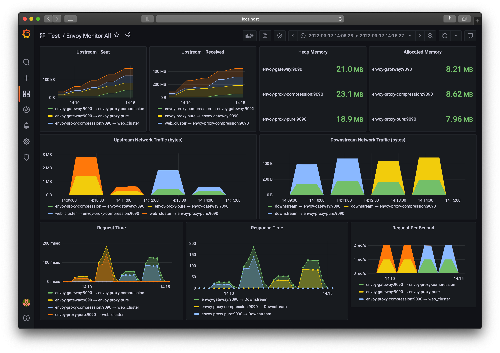

# Envoy Compression Test

## Architecture


## Setup

```bash
docker compose up -d
```

### Web Server Setup

```bash
docker compose exec web sh

yarn start
```

### Attacker Setup

[Attack Scenario](./attacker/run.sh)

```bash
docker compose exec attacker bash

# Communication Check
curl http://envoy-gateway:8000/ping -H "target-proxy: pure"
curl http://envoy-gateway:8000/ping -H "target-proxy: compression"

# Request  : envoy-gateway:8000 --------> envoy-proxy-pure:8000 --------> web:80
# Response : envoy-gateway:8000 <-------- envoy-proxy-pure:8000 <-------- web:80
curl http://envoy-gateway:8000 -H "target-proxy: pure" -v > /dev/null
echo "GET http://envoy-gateway:8000" | ./vegeta attack -rate 1/1s -header "target-proxy: pure" > /dev/null

# Request  : envoy-gateway:8000 --------> envoy-proxy-pure:8000 --------> web:80
# Response : envoy-gateway:8000 <-------- envoy-proxy-pure:8000 <-(gzip)- web:80
curl http://envoy-gateway:8000 -H "target-proxy: pure" -H "web-compression: true" -H "accept-encoding: gzip" -v > /dev/null
echo "GET http://envoy-gateway:8000" | ./vegeta attack -rate 1/1s -header "target-proxy: pure" -header "web-compression: true" -header "accept-encoding: gzip" > /dev/null

# Request  : envoy-gateway:8000 --------> envoy-proxy-compression:8000 --------> web:80
# Response : envoy-gateway:8000 <-(gzip)- envoy-proxy-compression:8000 <-------- web:80
curl http://envoy-gateway:8000 -H "target-proxy: compression" -H "accept-encoding: gzip" -v > /dev/null
echo "GET http://envoy-gateway:8000" | ./vegeta attack -rate 1/1s -header "target-proxy: compression" -header "accept-encoding: gzip" > /dev/null

# Request  : envoy-gateway:8000 --------> envoy-proxy-compression:8000 --------> web:80
# Response : envoy-gateway:8000 <-(gzip)- envoy-proxy-compression:8000 <-(gzip)- web:80
curl http://envoy-gateway:8000 -H "target-proxy: compression" -H "web-compression: true" -H "accept-encoding: gzip" -v > /dev/null
echo "GET http://envoy-gateway:8000" | ./vegeta attack -rate 1/1s -header "target-proxy: compression" -header "web-compression: true" -header "accept-encoding: gzip" > /dev/null
```

Check Response Header: `transfer-encoding: chunked` or `content-encoding: *`

## Dashboard

- Grafana: <http://localhost:5000>
  - User: `admin`
  - Password: `admin`

## Docs: How It Works

* https://www.envoyproxy.io/docs/envoy/latest/configuration/http/http_filters/compressor_filter#how-it-works

## Report

[Attack Scenario](./attacker/run.sh)



### Summary

#### Case 1: レスポンスの圧縮をenvoy-proxy-pure、webの両方で実施しない場合

* レスポンスを圧縮せずにそのまま返す
* envoy-gateway、envoy-proxy-pureの両方で同じサイズを観測する

#### Case 2: レスポンスの圧縮をwebで実施、envoy-proxy-pureで実施しない

* webで圧縮されたレスポンスはそのままenvoy-proxy-pure、envoy-gateway両方で同じサイズを観測する

#### Case 3: レスポンスの圧縮をenvoy-proxy-compressionで実施、webで実施しない

* envoy-proxy-compression到達時点で圧縮されていないことが観測される
* envoy-gatewayではenvoy-proxy-compressionで圧縮されたレスポンスが観測される
* Case 2のwebとenvoy-proxy-compressionの圧縮設定がやや違うため圧縮率が違う

#### Case 4: レスポンスの圧縮をenvoy-proxy-compressionとwebで実施

* envoy-proxy-compression到達時点で圧縮されていることが観測される
* envoy-gatewayではenvoy-proxy-compressionでは圧縮は実施されずそのまま通過する

### その他

* `Accept-Encoding: gzip`をつけなければenvoyのcompressionは実施されない

## TODO

* [ ] Request / Response の時間計測
* [ ] 圧縮率の計測

